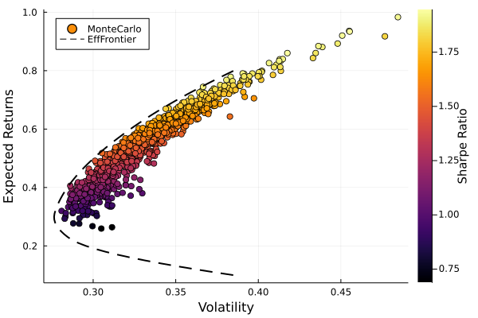

# PortfolioOptim.jl

A Julia package for the optimization of financial portfolios.

<div align="center">


	
</div>

## Installation

```julia
using Pkg; Pkg.add(url="https://github.com/harrisonlabollita/PortfolioOptim.jl.git")
```

## Example

### Portfolio Optimization
Here, we can generate our portfolio and optimize the allocations using the two supported optimizers: EfficientFrontier and MonteCarloOptimizer.
```julia
using PortfolioOptim

tickers = ["GOOG", "DIS", "FB", "AMZN", "AAPL", "TSLA"]
portfolio = build_portfolio(tickers, "2020-01-01", "2022-01-01")
target_returns = collect(0.1:0.01:0.8)
EF_results = EfficientFrontier(portfolio, target_returns)
MC_results = MonteCarloOptimizer(portfolio)
```

Here, we visualize the results from our portfolio optimization,

<p align="center">
<a href="https://github.com/harrisonlabollita/doc/examples/">

</a>
</p>


## Contributing

Pull requests and issues are welcome! Some of my todos are

**TODO**

- [ ] build analysis and visualization tools 
- [ ] build documentation
- [ ] build logo
- [ ] register on GeneralRegistry
